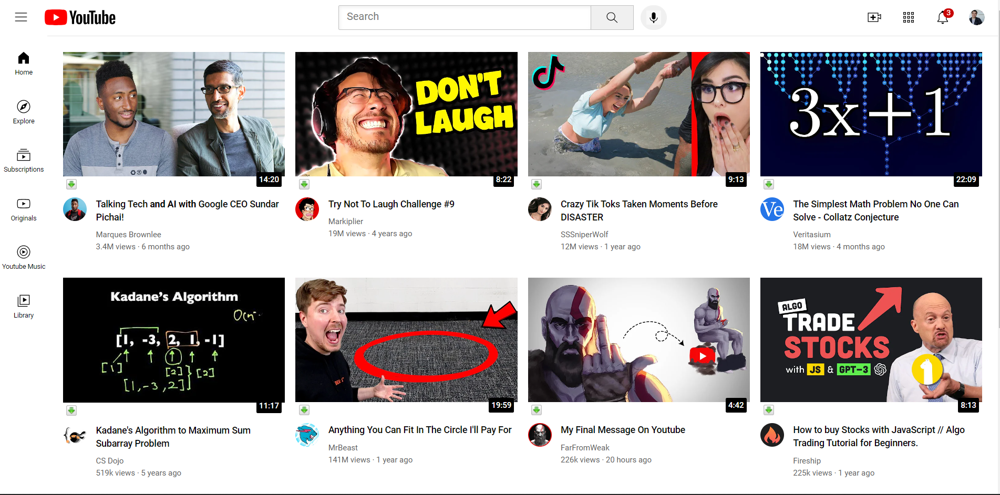

## Project Preview

# YouTube Landing Page Clone

This project is a clone of the YouTube landing page, created with HTML and CSS.

## Authors

- Wilbert Boadzo

## Description

This project is a simple clone of the YouTube landing page, demonstrating the use of HTML and CSS to recreate a familiar web interface. It includes the header, search bar, recommended videos, and footer sections found on the YouTube landing page.

## Challenges

Creating landing pages, even clones of existing websites, can present various challenges, including:

1. **Responsiveness**: Ensuring that the landing page looks and functions well on different screen sizes and devices can be challenging. Testing and adjusting styles for responsiveness is crucial.

2. **Cross-browser Compatibility**: Different web browsers may render HTML and CSS slightly differently. Testing the landing page on multiple browsers and ensuring cross-browser compatibility can be time-consuming.

3. **Optimizing Images and Media**: Handling images and videos efficiently to reduce page load times while maintaining visual quality can be tricky.

4. **Maintaining Consistency**: Achieving a consistent look and feel throughout the page, including fonts, colors, and spacing, can require attention to detail.

5. **Accessibility**: Ensuring that the landing page is accessible to users with disabilities by following web accessibility standards (e.g., ARIA roles, alt text for images) is important but can be complex.

6. **Browser DevTools**: Learning how to use browser developer tools effectively for debugging and fine-tuning the layout and styles is essential.

7. **Content and Data Integration**: Integrating dynamic content and real data (e.g., videos, comments) from a backend or API can add complexity to the project.

8. **Performance**: Optimizing the performance of the landing page by minimizing HTTP requests, using CSS and JavaScript minification, and employing other performance-enhancing techniques.

9. **Legal Considerations**: Being aware of copyright and legal considerations when using logos, images, or content from other websites, even for educational purposes.

## License

This project is licensed under the MIT License. See the [LICENSE](LICENSE) file for details.

